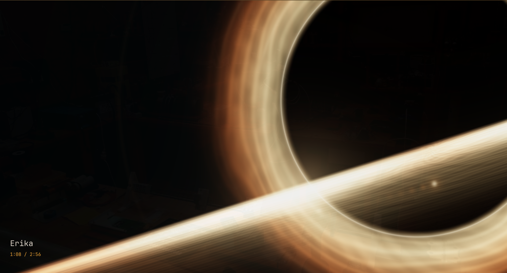

# omaMusi

**A local music player for Linux, with visuals that move to your music.**

Open your music folder, find a song, and start listening. omaMusi plays MP3,
FLAC, WAV, Ogg, Opus, M4A, AAC, and other audio formats. You can use the
keyboard, click a song, or drag music files into the window.



Version **0.10.0** · [MIT license](LICENSE)

Player and search use have been tested on **Omarchy and Ubuntu**. On
Omarchy, the player follows your theme. On GNOME, it uses a normal window
with title-bar controls.

## Install

Choose either the standalone installation or the Omarchy plugin below.
You need **Python 3.11 or newer**, **FFmpeg**, and an internet connection
for installation. Ubuntu users also need the `python3-venv` package.

### Ubuntu and other Linux desktops

Install Python, FFmpeg, and Git using your distribution's package manager.
Then open a terminal and run:

```bash
git clone https://github.com/ariDev1/omaMusi.git
cd omaMusi
python3 -m venv .venv
.venv/bin/python -m pip install -e .
mkdir -p ~/.local/bin
ln -s "$PWD/.venv/bin/omaMusi" ~/.local/bin/omaMusi
.venv/bin/python -m omamusi.desktop install
```

Keep the `omaMusi` folder: the launcher uses the installation inside it.
If your terminal cannot find `omaMusi`, use `~/.local/bin/omaMusi` instead.
If the launcher already exists, check your existing installation before
replacing it.

You can now open **omaMusi** from your application menu. It loads your
Music folder, including its subfolders. If there is no Music folder, it
opens an empty window where you can add files or browse to another folder.
The menu launcher uses your desktop's configured Music location, even if
the folder has a different name or is on another drive.

If omaMusi is already installed, add the menu entry by running
`.venv/bin/python -m omamusi.desktop install` from the project folder.
Remove just that entry with `.venv/bin/python -m omamusi.desktop remove`.

To update this installation, close the player and run these commands from
the `omaMusi` folder:

```bash
git pull --ff-only
.venv/bin/python -m pip install -e .
.venv/bin/python -m omamusi.desktop install
```

### Omarchy

The optional bar widget opens your Music folder with the Event Horizon
visual. These commands install the widget and the player:

```bash
omarchy pkg add python ffmpeg
omarchy plugin add https://github.com/ariDev1/omaMusi.git --enable
bash ~/.config/omarchy/plugins/io.github.aridev1.omamusi/scripts/setup-player.sh
```

The setup script also adds omaMusi to your application menu. You can use
either the menu entry or the bar widget to open the player.

If you already installed the standalone player, the widget can use it.
Skip the setup script in that case; it will not replace an existing
standalone launcher.

To update, close the player, then run:

```bash
omarchy plugin update io.github.aridev1.omamusi
bash ~/.config/omarchy/plugins/io.github.aridev1.omamusi/scripts/setup-player.sh
```

If you use a standalone installation with the widget, update the player
using the standalone instructions above.

To remove the player installed by the setup script and the widget:

```bash
bash ~/.config/omarchy/plugins/io.github.aridev1.omamusi/scripts/remove-player.sh
omarchy plugin remove io.github.aridev1.omamusi
```

Your music and saved playlists are kept.

## Open your music

From a terminal, run:

```bash
cd ~/Music
omaMusi
```

Music in that folder and all its subfolders is loaded. Playback starts
automatically. To open a folder from elsewhere, use:

```bash
omaMusi ~/Music --recursive
```

You can also open individual files:

```bash
omaMusi "song.flac" "another song.mp3"
```

Inside the player, press **O** to add files, press **C** to browse folders,
or drag files and folders into the window. Launching omaMusi again brings
the existing window back.

## Find a song

Press **/** and type part of a filename or folder name. Capitalization
doesn't matter. For example, searching for an album folder shows all loaded
songs inside it, including songs in its subfolders.

Press **Up** or **Down** to select a result, then **Enter** to play it.
Press **/** again to edit your search, or erase the text to show all songs.
If nothing matches, you stay in the search field so you can change the text.
Search uses file and folder names; it does not search artist or album tags.

## Keyboard controls

The footer shows the shortcuts, grouped by what they do.

| Key | What it does |
| --- | --- |
| Space | Play or pause |
| Up / Down | Select a song; K / J also work |
| Enter | Play the selected song |
| N / P | Next / previous song |
| R | Turn random playback on or off |
| Left / Right | Skip backward / forward 5 seconds |
| + or = / − | Raise / lower the volume |
| / | Search filenames and folders |
| O or Ctrl+O | Add music files |
| C | Browse folders |
| Ctrl+L | Type a folder path |
| A | Add the selected song to a saved playlist |
| B | Open saved playlists |
| V / Shift+V | Next / previous visual |
| F | Toggle fullscreen |
| Tab | Hide or show the song list |
| Escape | Leave a text field, cancel browsing, or leave fullscreen |
| Q | Quit |

While browsing folders, **Right** or **Enter** opens your selection,
**Left** or **Backspace** goes up one folder, and **L** plays the current
folder. **Up/Down** and **K/J** select items. Press **Escape** to return to
the song list.

Random playback starts off. Press **R** to turn it on; **N** then picks a
random song. **P** goes back through your listening history, or restarts
the current song. Random playback includes songs hidden by your search.

## Save a playlist

Select a song and press **A**. Choose an existing playlist, or select
**Create new playlist…**, type a name, and press **Enter**. If no song is
selected, omaMusi uses the song that's playing. Adding a song leaves the
music playing.

Press **B** to open your saved playlists:

| Key | What it does |
| --- | --- |
| Up / Down | Select a playlist or song |
| Enter | Play the selected playlist |
| Right / Left | View a playlist's songs / return to the playlist list |
| F2 | Rename a playlist |
| Delete | Remove a song from a playlist, or delete a playlist |
| Escape | Cancel or close |

Deleting a playlist asks for confirmation. **Enter** confirms;
**Escape** cancels. Removing a playlist or a song from it never deletes
music files. Missing files are marked and skipped during playback.
Playlists are saved automatically and are available the next time you open
the player.

## Choose a visual

Press **V** to cycle through eight visuals, or **Shift+V** to go back:

- **Event Horizon:** a black hole with a glowing disk.
- **Particle Dance:** colorful particles moving to the music.
- **Phi Cathedral:** changing geometric patterns.
- **Warp:** a flight through colored stars.
- **Spectrum:** frequency bars.
- **Waveform:** glowing sound traces with a transparent background.
- **Spectrogram:** a scrolling view of the sound's frequencies.
- **Cover Art:** your album cover, gently pulsing on a black background.

To start with a particular visual:

```bash
omaMusi ~/Music --recursive --view "cover art"
```

Cover Art uses artwork stored in the audio file, or an image named `cover`,
`folder`, `front`, or `album` in the song's folder. JPG, JPEG, PNG, and WebP
images work. If there is no readable cover image, the background stays
black. Visuals do not change the sound or your music files.

## Technical details and development

The animated visuals use OpenGL 3.3 or newer. A simpler software renderer
is available when hardware rendering cannot be used. Supported Python
packages are listed in [pyproject.toml](pyproject.toml).

Saved playlists are stored in `~/.local/share/omamusi/playlists.json`, or
under `$XDG_DATA_HOME` if you have set it. They refer to your music files,
so moving a file can leave a missing entry in a playlist.

The footer includes the version and Git revision. `+dirty` means local
changes have not been committed; `unknown` means Git information is
unavailable. Check the version in a terminal with `omaMusi --version`.

To run the tests from the project folder:

```bash
.venv/bin/python -m unittest discover -s tests
.venv/bin/python tests/smoke_gpu.py
```

The full suite needs access to an audio service; the GPU check also needs
a desktop session and a hardware GPU. GitHub Actions runs regression tests
and checks the package build. See [compatibility notes](docs/compatibility.md)
for tested dependency versions and detailed desktop checks, and the
[changelog](CHANGELOG.md) for changes between versions.
